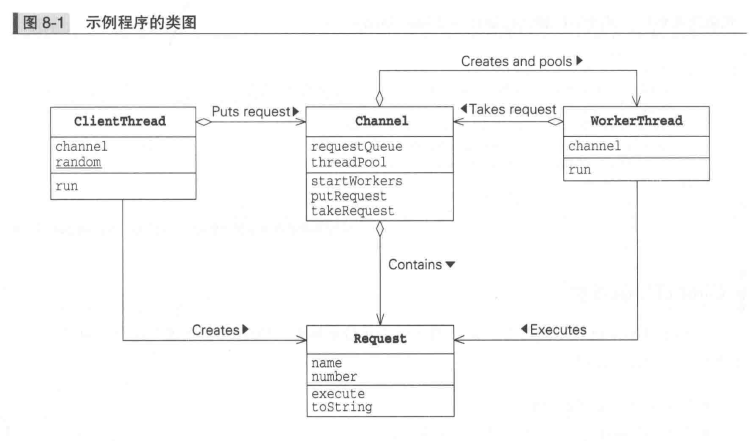
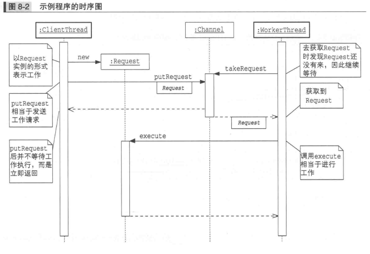

2.immutable模式
~~~~~~~~~~~~~~~~~~~~~~~~~~~~~~~~~~~~~~~~~
    就是不变的，不发生改变的意思。即保证类的不变性。
~~~~~~~~~~~~~~~~~~~~~~~~~~~~~~~~~~~~~~~~~
3.producer-consumer模式
~~~~~~~~~~~~~~~~~~~~~~~~~~~~~~~~~~~~~~~~~
    producer是生产者的意思，指生成数据的线程。
    consumer是消费者的意思，指使用数据的线程。

    producer-consumer模式在生产者和消费者之间加入了一个桥梁角色。
这个桥梁角色用于消除线程间处理速度的差异。
~~~~~~~~~~~~~~~~~~~~~~~~~~~~~~~~~~~~~~~~~
8.Worker Thread模式
* 工作没来就一直等，工作来了就干活
  
  

*  将调用和执行分离的目的是什么？
    * 提高响应速度。
    * 控制执行顺序（调度）
    * 可以取消和反复执行。
    * 通往分布式之路。 
    
9.Future模式
